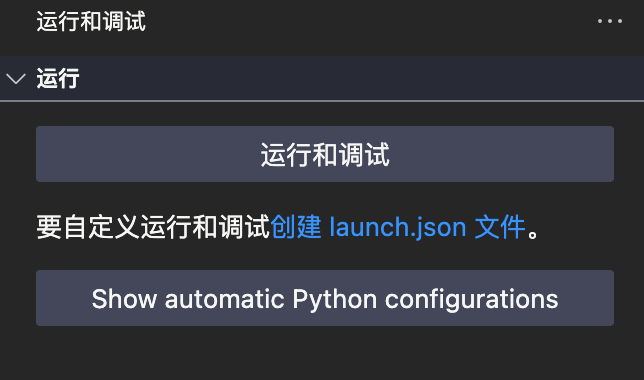

1. 用pip安装debugpy
2. 检查linux服务器上有无空闲端口

```bash
comm -23 <(seq 49152 65535 | sort) <(ss -tuln | awk '{print $4}' | cut -d':' -f2 | sort -u) | shuf | head -n 1
```

3. 在vscode&cursor&windsurf里创建launch.json文件



```json
{
    // 使用 IntelliSense 了解相关属性。 
    // 悬停以查看现有属性的描述。
    // 欲了解更多信息，请访问: https://go.microsoft.com/fwlink/?linkid=830387
    "version": "0.2.0",
    "configurations": [

        {
            "name": "Python: Attach",
            "type": "python",
            "request": "attach",
            "connect": {
                "host": "localhost",
                "port": 空闲端口号
            }
        }
    ]
}
```

1. 启动python文件

```bash
python -m debugpy --listen 空闲端口号 --wait-for-client your_python_file.py \  				
        --args_1 your_args_1 \  				
        --args_2 your_args_2 \ 				
        .....
```

