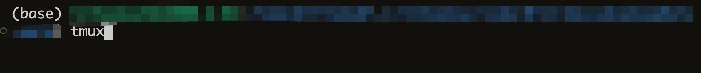
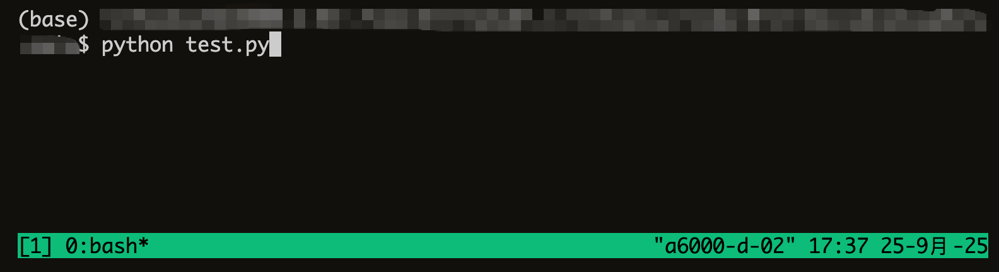
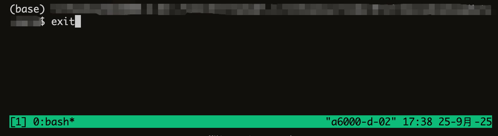

# 前言

我们有的时候想在后台跑任务，但是普通终端关闭了过后任务就中断了，那么如何在可能随便关闭终端和关机的前提下，把任务一直放在服务器上跑？tmux来帮你

# Dive into tmux in 1 minutes

## 进入tmux窗口



## 在tmux窗口中执行python命令/也能执行bash命令



## 运行完任务后kill这个tmux进程，对应于普通终端里的关闭



现在你已经会最基本的tmux操作了

# tmux相关操作

+ 在tmux上打开滚动模式：Ctrl + B，然后松开，再按[
+ tmux退出滚动模式：q
+ 查看已有的tmux对话：tmux ls
+ 重新连接名为my_session的会话：tmux attach -t my_session
+ 关闭tmux窗口但不退出tmux会话：Ctrl + B，然后松开，再按D
+ 杀死名为my_session的会话：tmux kill-session -t my_session
+ 创建名为my_session的tmux会话：tmux new -s my_session
+ 重命名tmux对话：tmux rename-session -t old_my_session new_my_session

# tmux配置文件修改

+ 编辑配置文件：vim ~/.tmux.conf
+ 输入以下内容：

```bash
set -g mouse on                  # 启用鼠标（可滚动、可选中）
setw -g mode-keys vi             # 复制模式用 vi 键位
set -g history-limit 10000       # 增加滚动历史行数
```

+ 按:wq保存文件
+ 输入tmux source-file ~/.tmux.conf生效
